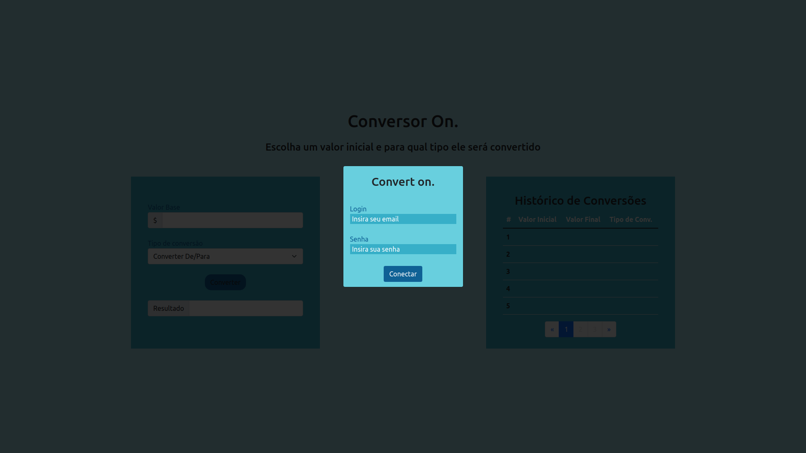
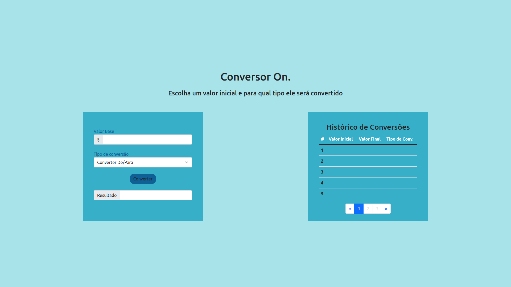
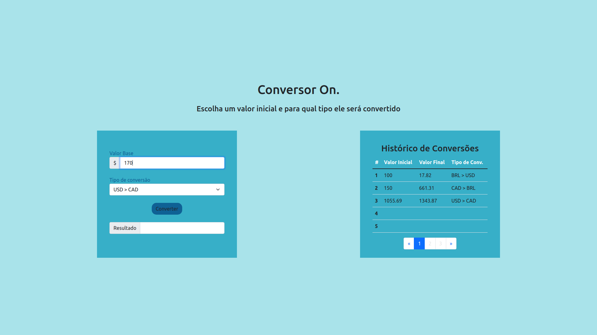
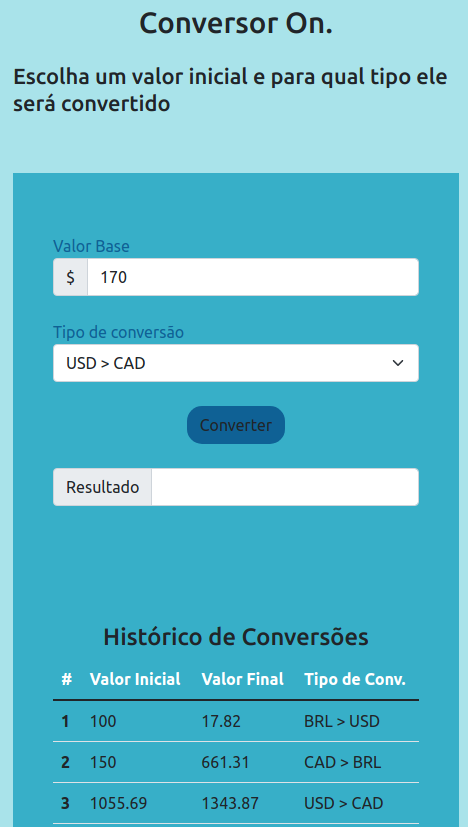

# **Projeto Conversor On.**
 
### O projeto tem como finalidade a criação de um sistema incorporado a um login por meio do banco de dados e um processo de cálculo automático entre moedas mundiais, de forma que os valores de conversão irão ser salvos do local storage, mas atualizando a cada 1 hora;
 
  
## **Tecnologias Utilizadas** 🦾
- VueJs;
- Bootstrap;
- Axios;
- Express;
- Sequelize;
- JsonWebToken;
- Mysql;
- NodeJs;
- Docker;
 
  
## **Inicialização** 💥
- Realize a clonagem do sistema pelo github;
- Vá na pasta criada e pelo terminal entre na pasta **backend**;
- Crie um servidor Mysql com as seguinte caracteristicas:
  
>   User: 'root';  
>   Password: 'root';  
>   Host: '172.17.0.2'  
>   Port: 3306
 
- Caso seja necessário, é possível trocar essa características de conexão no arquivo **"backend/src/database/index.js"**
- Execute o comando a seguir
> yarn add 
- Execute o comando a seguir para criar o banco de dados localmente
> yarn sequelize db:create 
- Execute o comando a seguir para inicializar o servidor backend
> yarn serve 
- Volte a pasta raiz e entre na pasta **frontend**;
- Execute o comando a seguir para inicializar o Vue;
> yarn server 
- Entre no link do server disponibilizado no console;
- Utilize as seguintes informações para logar no sistema web:
> Login: admin@admin  
> Senha: admin

  
 
## **Contato** 🥸
- Nome: Marcelo TJ;
- Nick: martex84;
- Linkedln: [link](https://www.linkedin.com/in/martex8/) ;
- Email: martex849@gmail.com
 
  
 
## **Imagens** 🗺️
 
### - **Tela Login**

 
### - **Tela Conversão Inicial**

 
### - **Tela Conversão Preenchida**

 
### - **Tela Conversão Preenchida Mobile**
